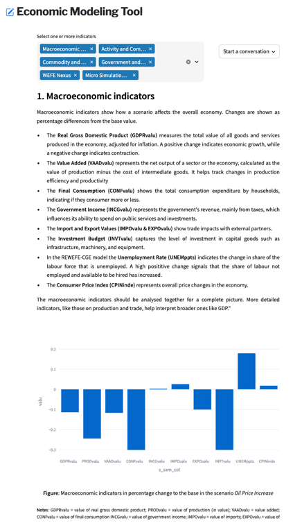

# InnWater CGE Visualization Interface

<p align="center">
  
</p>

<p align="center">
  <strong>Interactive visualization interface for CGE-based economic modelling within the InnWater project</strong>
</p>

---

<table>
<tr>
<td width="60%" valign="top">

## Overview

This visualization interface reflects the **Computable General Equilibrium (CGE)** component of the InnWater project’s
economic tools.  
It enables users to explore model outputs and interpret the implications of different **policy choices** or **simulation
scenarios** through an interactive web-based environment.

---

## Background

The InnWater project develops tools to support:

- **multi-level, cross-sector governance of water systems**
- **economic and financial modelling**, including tariff simulations
- **stakeholder engagement and governance assessment frameworks**

The CGE visualization interface serves as an access layer to economic model results, facilitating transparent analysis
and decision support.

---

## Technologies

The interface is implemented using the following technologies:

- **Python** – Core programming language.
- **Streamlit** – Web framework for the interactive visualization interface.
- **Pandas** – Data manipulation and analysis.
- **Plotly** – Interactive data visualizations.
- **Docker** – Containerization for reproducible and portable deployment.
- **HTTPX** – Communication with the AI Assistant API.

</td>
<td width="40%" valign="top">

<p align="center">
  
</p>

</td>
</tr>
</table>

---

## Usage

### Local Execution

1. Install the required dependencies:
   ```bash
   pip install -r requirements.txt

### Using Docker

1. Build and run the container using Docker Compose:
   bash
   docker-compose up --build

## Contact

- **CGE Model**: Martin Henseler - martin.henseler@univ-rouen.fr
- **Visualization and AI Assistant**: Oriol Alàs - oriol.alas@univ-rouen.fr